```mermaid
flowchart TD
    Start([Inicio: Cálculo de Booking]) --> API_Extract[1 y 2. Extracción vía API de El Gestor<br>Trae automáticamente las 10 columnas clave]
    
    API_Extract --> API_USD[4. Conversión Monetaria Automática<br>API consulta valor de USD/UF histórico a la Fecha de Emisión]
    
    API_USD --> Auto_Parse[5. Desglose Automático de Código<br>Extrae: Área, Categoría y Sub-categoría]
    
    Auto_Parse --> API_CRM[6. Asignación de Gerente de Cuenta<br>Cruce automático vía API con CRM o El Gestor]
    
    API_CRM --> Auto_Time[7. Temporalidad Automática<br>Calcula Mes y Cuartil según Fecha de Emisión]
    
    Auto_Time --> Filter_Inter[8. Filtro de Ventas Interempresa<br>API detecta si el proveedor es Acanto o Teknos]
    
    Filter_Inter --> Ctrl_Inter{Punto de Control:<br>Venta Interempresa}
    Ctrl_Inter -->|Revisión Rápida| Del_Inter[Eliminar registro de menor correlativo N<br>Evita duplicidad Acanto-Vadco]
    
    Del_Inter --> Filter_Prelim[9. Filtro de Negocios Preliminares<br>Sistema detecta correlativos duplicados PRE vs VTA]
    Ctrl_Inter -->|No aplica| Filter_Prelim
    
    Filter_Prelim --> Ctrl_Prelim{Punto de Control:<br>Duplicados PRE/VTA}
    Ctrl_Prelim -->|Revisión Rápida| Adj_Prelim[Decidir montos a considerar<br>y eliminar el preliminar duplicado]
    
    Adj_Prelim --> DB_Final[(Base de Datos Consolidada)]
    Ctrl_Prelim -->|No aplica| DB_Final
    
    DB_Final --> Dashboards([Fin: Análisis y KPIs Automatizados<br>- Metas mensuales y trimestrales<br>- % por Cuenta, Área, Categoría y Sub-categoría])
```

    %% Estilos para diferenciar procesos automáticos de decisiones
    style API_Extract fill:#e1f5fe,stroke:#03a9f4,stroke-width:2px
    style API_USD fill:#e1f5fe,stroke:#03a9f4,stroke-width:2px
    style Auto_Parse fill:#e1f5fe,stroke:#03a9f4,stroke-width:2px
    style API_CRM fill:#e1f5fe,stroke:#03a9f4,stroke-width:2px
    style Auto_Time fill:#e1f5fe,stroke:#03a9f4,stroke-width:2px
    style Filter_Inter fill:#e1f5fe,stroke:#03a9f4,stroke-width:2px
    style Filter_Prelim fill:#e1f5fe,stroke:#03a9f4,stroke-width:2px
    
    style Ctrl_Inter fill:#fff9c4,stroke:#fbc02d,stroke-width:2px
    style Ctrl_Prelim fill:#fff9c4,stroke:#fbc02d,stroke-width:2px
    style Del_Inter fill:#fff9c4,stroke:#fbc02d,stroke-width:1px
    style Adj_Prelim fill:#fff9c4,stroke:#fbc02d,stroke-width:1px
    
    style Start fill:#f8bbd0,stroke:#c2185b,stroke-width:2px
    style DB_Final fill:#e8f5e9,stroke:#4caf50,stroke-width:2px
    style Dashboards fill:#f8bbd0,stroke:#c2185b,stroke-width:2px
